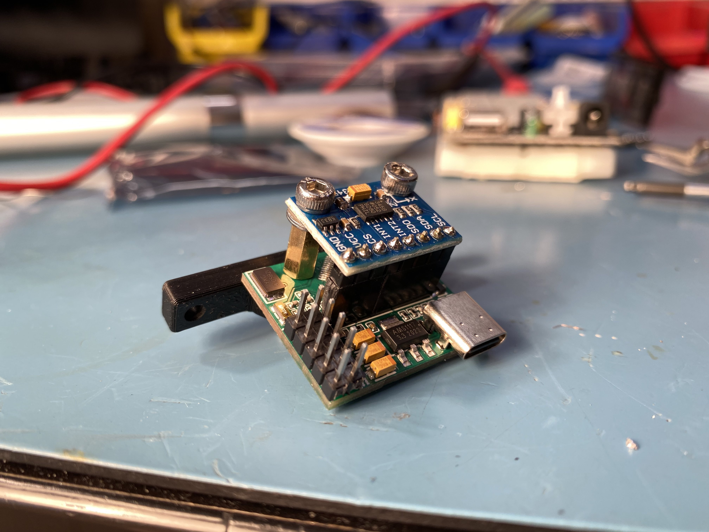

# Klipper USB Accelerometer
A PCB designed to make [Klipper's](https://github.com/KevinOConnor/klipper) [input shaping](https://github.com/Klipper3d/klipper/blob/master/docs/Resonance_Compensation.md) much easier by simplifying the wiring and config for [measuring resonances](https://github.com/KevinOConnor/klipper/blob/master/docs/Measuring_Resonances.md). You just need this PCB and a USB C cable.
<br>


## Purchasing a KUSBA
Known vendors:
- [DFH (US)](https://dfh.fm/collections/new-products/products/kusba-adxl345-accelerometer-by-xbst_)
- [Lab4450 (EU)](https://lab4450.com/product/ksuba-adxl345/)
- [Printy Please (UK)](https://www.printyplease.uk/KUSBA)
- [DREMC (AU)](https://store.dremc.com.au/products/kusba-usb-adxl345-accelerometer-for-klipper)
- [Orvil3D (AU)](https://orvil3d.com/products/kusba)
- [Unique Prints (AU)](https://uniqueprints.shop/shop/electronics-electrical/pcb/kusba-usb-adxl345-accelerometer-for-klipper/)
- [MakerPanda (Worldwide)](https://a.aliexpress.com/_EGhePj7)

This project is licensed under [GPL v3](./LICENSE), meaning vendors are allowed to sell KUSBA PCBs without paying me. If you'd like to support the development of this and future projects please consider [sponsoring](https://github.com/sponsors/xbst) me on GitHub. You can also subscribe on [Patreon](https://l.isiks.tech/patreon) or [YouTube](https://l.isiks.tech/member).

You can also use the included gerber files to order your own from a PCB manufacturer like [PCBWay](https://www.pcbway.com/setinvite.aspx?inviteid=374841) or [JLCPCB](https://jlcpcb.com/).
<br>


# Version 2
[YouTube Video](https://www.youtube.com/watch?v=gtrQXdAaXB4)

<br>**NOTE: The first reading from the accelerometer will be invalid (usually f2 vs e5). This is expected and your KUSBA will still work fine after the first query. Run ``ACCELEROMETER_QUERY`` once before starting measuring resonances.**

| Parts                                 |                                |
| ------------------------------------- | ------------------------------ |
| MCU                                   | RP2040                         |
| Accelerometer                         | ADXL345BCCZ-RL7                |
| 3.3V Regulator                        | AMS1117-3.3                    |
| Flash                                 | W25Q16JVSNIQ                   |
| Connector                             | USB C                          |
| Smallest SMT                          | 0402                           |
| Other Parts Needed                    | USB C Cable, M3 Screws         |
| Dimensions                            | 34.0 x 25.0 mm                 |
| Cost per PCB (ordering 5 from JLCPCB) | ~$15                           |

## Instructions

### 0. Klipper Prep
Taken from the [official Klipper docs](https://www.klipper3d.org/Measuring_Resonances.html#software-installation).
1. Run the following commands in order. This will take some time.
```
~/klippy-env/bin/pip install -v numpy
sudo apt update
sudo apt install python3-numpy python3-matplotlib
```

### 1. Flash Klipper to the MCU
1. Connect the KUSBA to your Raspbery Pi while holding down the button on the KUSBA.
2. SSH into your Raspberry Pi.
3. Go to the Klipper directory
```
cd klipper
```
4. Clean remaining files from previous build.
```
make clean
```
5. Choose the options for the build.
```
make menuconfig
```
Use the following settings:
```
Micro-controller Architecture: Raspberry Pi RP2040
Communication inferface: USB
```
6. Build the firmware
```
make
```
7. Find the storage location of the KUSBA. This will usually be sda1. Use this command one time with the KUSBA unplugged and one time with KUSBA plugged in (while holding down the button on the KUSBA) to verify.
```
ls /dev/
```
8. Flash the firmware.
```
sudo mount /dev/sda1 /mnt
sudo cp out/klipper.uf2 /mnt
sudo umount /mnt
```

### 2. Configure Klipper
1. Go back to the home directory.
```
cd ~
```
2. Download the [adxlmcu.cfg](./Firmware/v2/adxlmcu.cfg) file from this repo. Octoprint:
```
sudo wget https://raw.githubusercontent.com/xbst/KUSBA/main/Firmware/v2/adxlmcu.cfg
```
Mainsail: (or if config files are in klipper_config instead of home)
```
cd klipper_config
sudo wget https://raw.githubusercontent.com/xbst/KUSBA/main/Firmware/v2/adxlmcu.cfg
```
3. Find your MCU address.
```
ls /dev/serial/by-id/*
```
4. Edit the adxlmcu.cfg file. Change the MCU serial address and the probe points.
```
sudo nano adxlmcu.cfg
```
5. Add the following to your printer.cfg:
```
[include adxlmcu.cfg]
```
6. Do your testing. When done comment the include line to disable the KUSBA. (If you don't do this and unplug the KUSBA, Klipper won't work.)
```
# [include adxlmcu.cfg]
```

<br>

### NOTE: The first reading from the accelerometer will be invalid (usually f2 vs e5). This is expected and your KUSBA will still work fine after the first query. Run ``ACCELEROMETER_QUERY`` once before starting measuring resonances.

# Version 1

**FKA: ADXL345 MCU**
<br>[YouTube Video](https://www.youtube.com/watch?v=tDQd-jGegX0)



| Parts                                 |                                                              |
| ------------------------------------- | ------------------------------------------------------------ |
| MCU                                   | STM32F103                                                    |
| Accelerometer                         | External ADXL345 Module                                      |
| 3.3V Regulator                        | AMS1117-3.3                                                  |
| Flash                                 | N/A                                                          |
| Connector                             | [USB C](https://www.digikey.com/en/products/detail/gct/USB4085-GF-A/9859733) |
| Smallest SMT                          | 0402                                                         |
| Other Parts Needed                    | ADXL345 Module, USB C Cable, M3 Screws, UART Programmer      |
| Dimensions                            | 25.0 x 30.0 mm                                               |
| Cost per PCB (ordering 5 from JLCPCB) | ~$25                                                         |

## Instructions

**Warning: Make sure to use plastic washers between metal screws and PCB!**

### 0. Klipper Prep
Taken from the [official Klipper docs](https://www.klipper3d.org/Measuring_Resonances.html#software-installation).
1. Run the following commands in order. This will take some time.
```
~/klippy-env/bin/pip install -v numpy
sudo apt update
sudo apt install python3-numpy python3-matplotlib
```
### 1. Flash the Bootloader
You will need a USB UART programmer. I recommend using a CP2012 programmer, because it is cheap, easy to source, and it works.
Programmer:
[Aliexpress](https://s.click.aliexpress.com/e/_AB7gkA)
[Amazon](https://amzn.to/2OTzpI8)

You will also need some Female/Female dupont cables:
[Aliexpress](https://s.click.aliexpress.com/e/_9GgrhS)
[Amazon](https://amzn.to/3uAZU5E)

1. Download & install the [CP2012 drivers](https://www.silabs.com/developers/usb-to-uart-bridge-vcp-drivers). (on your Windows PC)
2. Download & install the [flasher](https://www.st.com/en/development-tools/flasher-stm32.html). (on your Windows PC)
3. Download the [STM32duino bootloader](https://github.com/rogerclarkmelbourne/STM32duino-bootloader/blob/master/binaries/maple_mini_boot20.bin). (on your Windows PC)
4. Jump the boot pins:
<br>BOOT0 > VCC
<br>BOOT1 > GND
5. Connect power from UART programmer:
<br>3V3 > VCC
<br>GND > GND
6. Connect the UART pins:
<br>TX > RX1
<br>RX > TX1
7. Plug in the UART programmer to your Windows PC.
8. Launch the Demonstratior GUI (STM32 Flasher Software).
9. Choose the correct COM port, hit next, and next again.
10. Make sure the chip detected in this step is correct, hit next again.
11. Choose "Download to device", click "..." to select the bin file. You will need to change the file type from .s19 to .bin in the dialog. Check "Verify after download", and hit next.
12. The bootloader will now be flashed. One it is complete you can exit the program. Unplug the programmer, and remove all wires and jumpers from the PCB.

### 2. Flash Klipper to the MCU
1. Connect the KUSBA to your Raspbery Pi. The LED on the PCB should be flashing.
2. SSH into your Raspberry Pi.
3. Go to the Klipper directory
```
cd klipper
```
4. Clean remaining files from previous build.
```
make clean
```
5. Choose the options for the build.
```
make menuconfig
```
Use the following settings:
```
Micro-controller Architecture: STMicroelectronics STM32
Processor Model: STM32F103
Bootloader Offset: 8KiB Bootloader (stm32duino)
```
6. Build the firmware
```
make
```
7. Verify that the MCU is connected. There should be a "1eaf:0003" device connected. 
```
lsusb
```
If there is no "1eaf:0003" but there is a "1eaf:0004":
<br>
Sometimes the bootloader runs for only a short period after boot (if it thinks there is already a program, so it boots to it). If you unplug & replug in the mcu, and run the "lsusb" quickly enough, you will see a "1eaf:0003". If this is the case, you will need to time the next step well.

8. Flash the firmware.
```
dfu-util -d 1eaf:0003 -a 2 -R -D out/klipper.bin
```
9. Reset or unplug and replug in the MCU.

### 3. Configure Klipper
1. Go back to the home directory.
```
cd ~
```
2. Download the [adxlmcu.cfg](./Firmware/v1/adxlmcu.cfg) file from this repo using:
```
sudo wget https://raw.githubusercontent.com/xbst/KUSBA/main/Firmware/v1/adxlmcu.cfg
```
3. Find your MCU address.
```
ls /dev/serial/by-id/*
```
4. Edit the adxlmcu.cfg file. Change the MCU serial address and the probe points.
```
sudo nano adxlmcu.cfg
```
5. Add the following to your printer.cfg:
```
[include adxlmcu.cfg]
```
6. Do your testing. When done comment the include line to disable the KUSBA. (If you don't do this and unplug the KUSBA, Klipper won't work.)
```
# [include adxlmcu.cfg]
```

## Toolhead Mounts

There are .STL files included for mounting the PCBs on various toolheads. Feel free to create a PR or send me the STL files if you designed custom mounts.
The .STEP model of the PCB and the SB and mini-AB mounts are also included in this repo.
<br> 
## Version 1 or 2?
TL;DR: v2 is better
| v1                                      | v2                                |
| --------------------------------------- | --------------------------------- |
| More expensive                          | Cheaper                           |
| Uses unobtanium parts                   | All parts are easy to source      |
| Requires external UART programmer       | Not needed                        |
| More complicated initial setup          | Easier initial setup              |
| Requires external GY-291 ADXL345 Module | ADXL345 is on the PCB, not needed |
| Takes more room (with ADXL345)          | Takes less room (easier to mount) |
| PCB is smaller                          | PCB is larger                     |
## YouTube

I am a YouTube content creator, and these projects were designed for my videos. If you want content about these projects & more, please consider [subscribing to my YouTube channel](https://www.youtube.com/channel/UClAWYmCkHjsbaX9Wz1df2mg).
<br>

If you feel like contributing to the development of this project and other projects like this you can sponsor me on [GitHub](https://github.com/sponsors/xbst), subscribe on [Patreon](https://l.isiks.tech/patreon) or [YouTube](https://l.isiks.tech/member).

## Notes
- This readme file contains Amazon Associate, Aliexpress affiliate, PCBWay affiliate links. I make a comission on qualifying purchases.
- This project does not come with any warranty, if you choose to build/use a KUSBA, you are doing this at your own risk!
- If you want to sell KUSBA PCBs, you are allowed to, and you will not owe me any royalties. **You cannot claim that I endorse the sale**. You can check the license file for more information. However, if you **wish** to give me a share you can sponsor me on [GitHub](https://github.com/sponsors/xbst), subscribe on [Patreon](https://l.isiks.tech/patreon) or [YouTube](https://l.isiks.tech/member).
